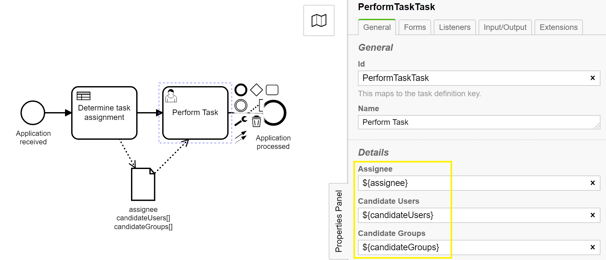
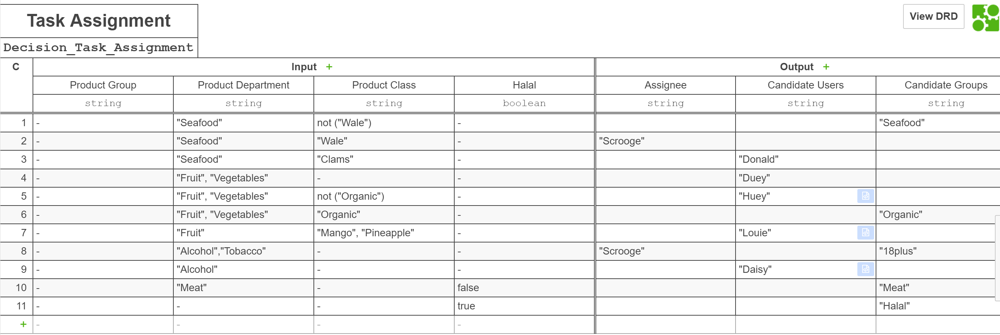
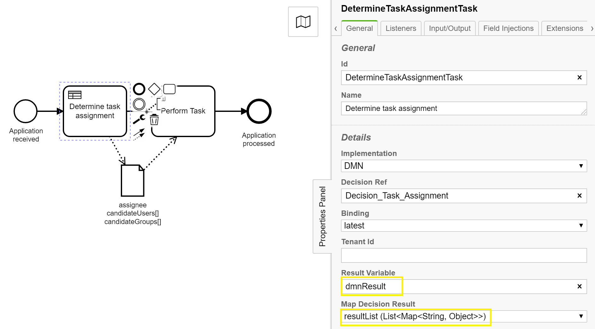
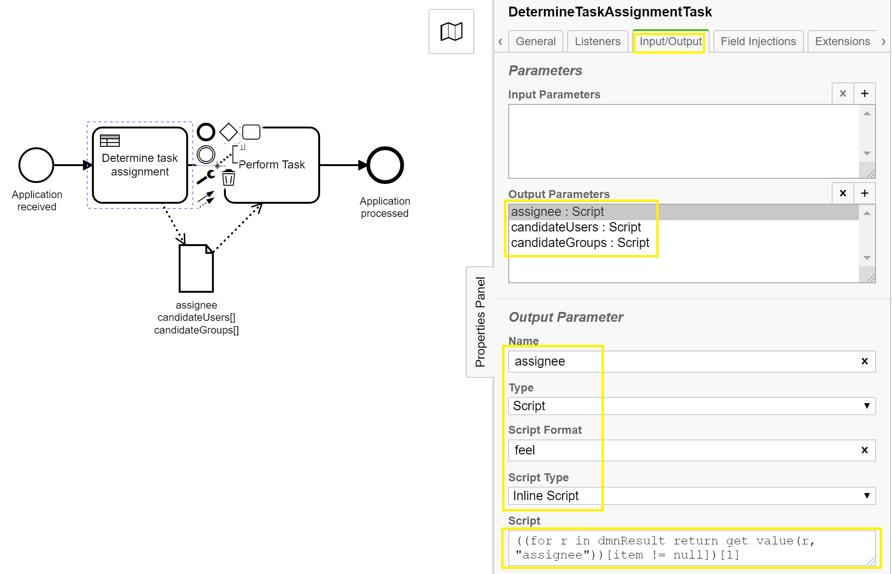

# User Task Assignment based on a DMN Decision Table

In business processes involving human workflow the task assignment logic can become quite elaborate.
For instance the processing of insurance claims, or other variants of approval processes may require many or complex task assignment rules.
The [Decision Model and Notation (DMN)](https://www.omg.org/dmn/) decision tables are an excellent tool to manage such rules - outside of code, in a business user-friendly way.

Camunda v7.13 (May 2020) ships with the [FEEL Scala Engine](https://docs.camunda.org/manual/latest/reference/dmn11/feel/), 
which already supports the [DMN standard version 1.3](https://www.omg.org/spec/DMN/About-DMN/) released in March 2020. 
[Friendly Enough Expression Language (FEEL)](https://camunda.github.io/feel-scala/) expressions now 
allow us a more elegant mapping between decision table results and task assignment parameters.

## Example Process
This example uses a trivial [BPMN Process](src/main/resources/Approval.bpmn) only consisting of a business rule task, implemented by a DMN file, and a user task, which gets assigned based on the output variables of the rules task. The data object reference shown in the diagram is only for documentation purposes. 
It has no technical implications and can be removed. 

### User Task


A [Camunda User Task](https://docs.camunda.org/manual/latest/reference/bpmn20/tasks/user-task/#user-assignment) offers three parameters, which are relevant to task assignment:
- assignee (a specific user who must perform the task)
- candidate users (a list of specific users who can perform a task)
- candidate groups (a list of user groups who can perform the task)   

In this example these parameters get bound to a process variable using *${variable_name}*. This 
allows us to let the task assignment depend on the output of previous elements (here the business rule task).

### Decision Table
The example  uses three product attributes as input to determine the task assignment.
The [Hit Policy](https://docs.camunda.org/manual/latest/reference/dmn11/decision-table/hit-policy/#collect-hit-policy) 
is set to *Collect* because the intention is to evaluate all rules and create lists of all 
possible task assignments. (The task assignment logic will later automatically assign the task
 to an individual user in case a specific assignee is set by a rule.) 



### Business Rule Task
Due to the hit policy (**C**) the result will be a list of rules (rows) which fire for a given instance. As the decision table produces several outputs (colums) each item in the result list will contain a collection 
of up to 3 values (*assignee, candidateUsers, candidateGroups*). In the properties tab of the business rule task the decision result needs to be set to reflect this expected data structure (a List of collections) as shown below. The result variable name, here *dmnResult*, can be chosen freely. It variable name is subsequently used in the mapping expressions.  
    


The final step is to map the output of the business rule task to the three variables used for the task assignment.
This can be done on the "Input/Output" properties tab of the business rule task using *feel* scripts.

To determine the list of candidate users / candidate user groups we
- go through list of results (rows), picking the "candidateUsers" / "candidateGroups" value from each row
- filter empty entries from the resulting list<br/>
```(for r in dmnResult return get value(r, "candidateUsers"))[item != null]```
```(for r in dmnResult return get value(r, "candidateGroups"))[item != null]```

To determine the assignee we 
- go through list of results (rows), picking the "assignee" value from each row
- filter empty values from the resulting list
- pick the first assignee in the list (assignee can only be one value, not a list)<br/>
```((for r in dmnResult return get value(r, "assignee"))[item != null])[1]```




## Value Maper Configuration

For this approach to work, as of version 7.13.0-alpha4, Camunda still requires the registration of a customer value mapper. The mapper is registered by placing a text file called *org.camunda.feel.valuemapper.CustomValueMapper*
into the folder . <br/>*This step will likely no longer be required in newer versions.*

## JUnit Test
The project also contains a JUnit test  with a few tests for different task assignments.
You can run it in your IDE or using:<br/>
```mvn clean test```
### Step through the process manually 
To step through the process manually, you can start the server using your IDE or

```mvn spring-boot:run```

After the server has started you ca access the Camunda tasklist via http://localhost:8080/app/tasklist/default. Use the credentials *demo / demo* to login.


